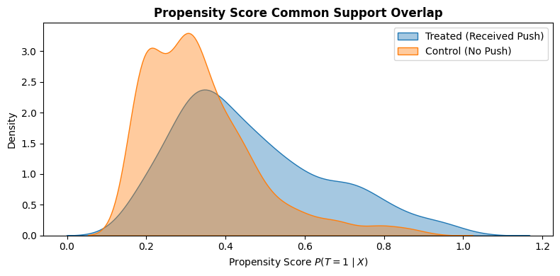

# OTT User Behavior & Causal Engagement Modeling

An end-to-end causal inference pipeline evaluating the true incremental impact of push notification campaigns on OTT user watch time. Built with **Microsoft `DoWhy`**, **Scikit-Learn**, **Pandas**, and **Seaborn**.

---

## Executive Summary

Streaming platforms frequently deploy push notifications to re-engage users. However, standard machine learning and observational metrics suffer from severe **selection bias**: highly active power users watch more content naturally *and* are far more likely to receive and click push notifications.

This project addresses confounding bias by formalizing a **Directed Acyclic Graph (DAG)** and comparing multiple causal estimators against synthetic ground-truth data (+4.50 hrs uplift).

---

## Tech Stack & Methodology

* **Language & Libraries:** Python 3.12, `DoWhy`, `Scikit-Learn`, `Pandas`, `NumPy`, `Seaborn`, `Matplotlib`
* **Causal Identification:** Backdoor Criterion via Directed Acyclic Graphs (DAG)
* **Estimation Methods:**
  * Propensity Score Matching (PSM)
  * Inverse Probability Weighting (IPW)
  * Linear Regression Covariate Adjustment
* **Validation & Refutation:** Placebo Treatment Refutation & Positivity/Common Support Overlap Verification

---

## Results Summary

| Estimation Approach | Watch Time Lift (hrs) | Status / Deviation |
| :--- | :---: | :--- |
| **Ground Truth Effect** | **~4.50** | Target Baseline |
| **Naive Observational Difference** | **11.89** | Heavily Biased (+164% Overestimation) |
| **Propensity Score Matching (PSM)** | **4.42** | Converged (-0.08 hrs error) |
| **Linear Regression Adjustment** | **4.38** | Converged (-0.12 hrs error) |
| **Inverse Probability Weighting (IPW)** | **4.22** | Converged (-0.28 hrs error) |
| **Placebo Refutation Test** | **-0.01** | Passed (Noise drops to ~0.0 hrs) |

---

## Visualizing Positivity & Common Support

To verify the **Positivity Assumption** ($0 < P(T=1 \mid X) < 1$), we evaluate the overlap of propensity score distributions across treated and control units:



*The density plot confirms substantial common support overlap between 0.10 and 0.80, proving that treated and control users share comparable propensity profiles for valid causal identification.*

---

## Key Findings & Insights

* **Confounding Bias Stripped:** Naive observational differences overreported notification impact at **11.89 hours**. All three causal estimators successfully adjusted for user activity (`hist_watch`) and device preference (`device_type`), tightly converging around the true ground truth (**~4.50 hours**).
* **Positivity Assumption Verified:** Propensity score density estimation confirmed strong common support overlap across treated and control groups ($0.1 < P(T=1 \mid X) < 0.8$).
* **Model Stability Confirmed:** Passing the Placebo Treatment refutation test (**-0.01 hours**) statistically verifies that our causal graph structure is free from unobserved confounding or false noise correlations.
* **Subgroup Heterogeneity (CATE):**
  * **Mobile Users:** 12.84 hrs observational difference
  * **Smart TV Users:** 10.43 hrs observational difference  
  * *Insight:* Subgroup responsiveness indicates higher intervention potential on mobile devices, providing actionable guidance for targeted notifications rather than uniform broadcasts.

---

## How to Run

1. **Open directly in Google Colab:**
   * Open `OTT_Causal_Inference_DoWhy.ipynb` in Colab.
   * Run all cells sequentially (**Runtime > Run all**).

2. **Run locally:**
   ```bash
   git clone [https://github.com/arohi06/OTT-User-Behavior-Causal-Inference.git](https://github.com/arohi06/OTT-User-Behavior-Causal-Inference.git)
   cd OTT-User-Behavior-Causal-Inference
   pip install dowhy pandas numpy scikit-learn matplotlib seaborn
